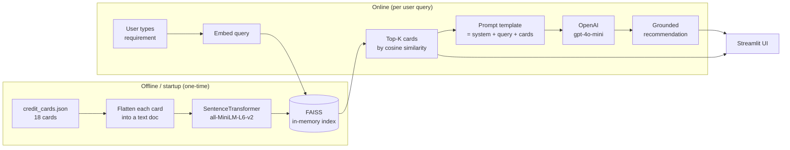
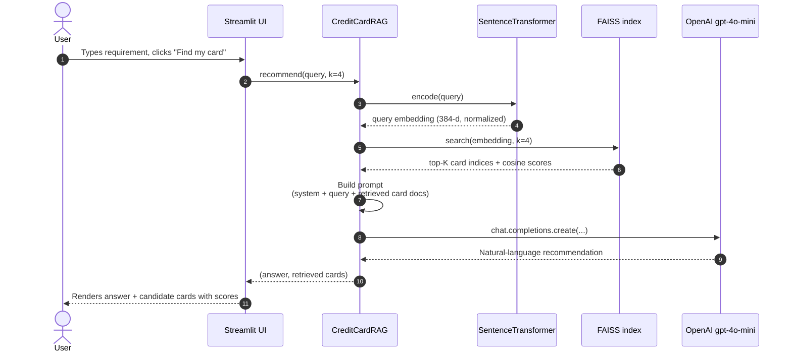

# 💳 Credit Card Finder — RAG POC

A Retrieval-Augmented Generation (RAG) proof-of-concept that turns a natural-language
requirement from a user — e.g. *"I want a card with no annual fee, high cashback on
groceries and online shopping, and some airport lounge access"* — into a grounded
recommendation from a curated catalog of Indian credit cards.

The POC is intentionally small and self-contained so you can read every line of it in
15 minutes and understand what each piece of the RAG stack is doing.

---

## 📖 Table of contents

1. [Why this POC exists](#-why-this-poc-exists)
2. [What the user experiences](#-what-the-user-experiences)
3. [UI mockup](#-ui-mockup)
4. [High-level architecture](#-high-level-architecture)
5. [End-to-end workflow](#-end-to-end-workflow)
6. [Technical components](#-technical-components)
7. [Project structure](#-project-structure)
8. [Setup & run](#-setup--run)
9. [Example queries & expected behaviour](#-example-queries--expected-behaviour)
10. [Limitations](#-limitations)
11. [Extending the POC](#-extending-the-poc)

---

## 🎯 Why this POC exists

Credit card comparison sites are category-driven — you land on "best cashback card",
"best travel card" — and you still have to read 10 listicles to figure out which one
fits *your* situation. This POC flips it:

> **The user writes a sentence. The system returns the right card.**

It's also a minimal teaching example of a RAG pipeline: local embeddings, a vector
index, a prompt template, and an LLM, all wired together in ~150 lines of Python.

---

## 🧑‍💻 What the user experiences

1. Opens a simple web page (`streamlit run src/app.py`).
2. Types their requirement in plain English into a text area.
3. Clicks **Find my card**.
4. Sees:
   - A **top pick** with one-line justification.
   - A **runner-up** if relevant.
   - **Caveats** — fees, eligibility, reward caps.
   - The list of **candidate cards** that were retrieved, with similarity scores
     and full card details (expandable).

No logins, no forms, no drop-downs. Just a prompt box.

---

## 🖼 UI mockup

```
┌──────────────────────────────────────────────────────────────────────────┐
│  💳 Credit Card Finder                                                   │
│  POC: tell me what you want in a credit card and I'll pick the best fit. │
│                                                                          │
│  ┌──────────────────────────────────────────────────────────────────┐    │
│  │ Describe what you're looking for                                 │    │
│  │ ┌──────────────────────────────────────────────────────────────┐ │    │
│  │ │ I want a card with no annual fee, high cashback on groceries │ │    │
│  │ │ and online shopping, and some airport lounge access.         │ │    │
│  │ │                                                              │ │    │
│  │ └──────────────────────────────────────────────────────────────┘ │    │
│  │                                                                  │    │
│  │ How many candidate cards to consider:   ●━━━━━━━━━━━━━  4        │    │
│  │                                                                  │    │
│  │                                                    [ Find my card ] │
│  └──────────────────────────────────────────────────────────────────┘    │
│                                                                          │
│  ── Recommendation ───────────────────────────────────────────────────── │
│                                                                          │
│  Top pick: Amazon Pay ICICI Credit Card — lifetime free, 5% cashback on  │
│  Amazon (Prime), 2% on Amazon Pay partners, 1% elsewhere. Best fit for   │
│  "no annual fee + online shopping".                                      │
│                                                                          │
│  Runner-up: HDFC Millennia — ₹1,000 fee (waived on ₹1L spend) but adds   │
│  5% on Flipkart/Myntra/Swiggy/Zomato + 8 domestic lounge visits/year,    │
│  which matches your lounge-access ask.                                   │
│                                                                          │
│  Caveats: Millennia's lounge perk requires ₹1L annual spend to waive     │
│  fees. Amazon Pay ICICI has no lounge access.                            │
│                                                                          │
│  ── Retrieved candidate cards ───────────────────────────────────────────│
│                                                                          │
│  ▸ Amazon Pay ICICI Credit Card   — similarity 0.612                     │
│  ▸ HDFC Millennia Credit Card     — similarity 0.584                     │
│  ▸ SBI Cashback Credit Card       — similarity 0.561                     │
│  ▸ Flipkart Axis Bank Credit Card — similarity 0.538                     │
└──────────────────────────────────────────────────────────────────────────┘
```

*(Illustrative — exact wording depends on the LLM. The recommendation is
always constructed only from the retrieved cards, not from the model's
training data.)*

---

## 🏗 High-level architecture



**Two phases:**

- **Offline (startup)** — load catalog, embed each card once, build a FAISS index.
  Cached across requests via `st.cache_resource`.
- **Online (per query)** — embed the query, retrieve top-K, prompt the LLM, return.

Everything before the LLM call runs locally on CPU. Only the final generation
step touches an external API.

---

## 🔁 End-to-end workflow



### Step-by-step

| # | What happens | Where in code |
|---|---|---|
| 1 | Catalog loaded from JSON | `load_cards()` in `src/rag.py` |
| 2 | Each card flattened into a text doc (name, issuer, fees, rewards, perks…) | `CreditCard.to_document()` |
| 3 | Docs embedded with MiniLM-L6-v2 (384-d vectors, L2-normalized) | `CreditCardRAG.__init__` |
| 4 | Vectors added to `faiss.IndexFlatIP` (inner product = cosine on normalized vectors) | `CreditCardRAG.__init__` |
| 5 | User query embedded the same way | `CreditCardRAG.retrieve` |
| 6 | FAISS returns top-K most similar cards | `CreditCardRAG.retrieve` |
| 7 | Retrieved cards + query injected into a prompt template | `CreditCardRAG.recommend` |
| 8 | OpenAI chat API called with `temperature=0.2` for deterministic output | `CreditCardRAG.recommend` |
| 9 | Answer + retrieved candidates rendered in Streamlit | `src/app.py` |

---

## 🔧 Technical components

### 1. Data — `data/credit_cards.json`

A hand-written catalog of 18 Indian credit cards. Each entry has:

```jsonc
{
  "name": "HDFC Millennia Credit Card",
  "issuer": "HDFC Bank",
  "annual_fee_inr": 1000,
  "joining_fee_inr": 1000,
  "fee_waiver": "Annual fee waived on spend of INR 1,00,000 in a year",
  "rewards": "5% cashback on Amazon, Flipkart, Myntra, Swiggy, ...",
  "best_for": "Online shoppers, millennials, food delivery...",
  "perks": "8 complimentary domestic airport lounge visits per year, ...",
  "income_requirement": "Salaried INR 35,000/month or ...",
  "credit_score": "Good (750+)",
  "network": "Visa / Mastercard",
  "foreign_transaction_fee": "3.5%"
}
```

The retrieval quality depends heavily on how descriptive these fields are —
particularly `best_for`, `rewards`, and `perks`, because that's where the
user's query vocabulary will match.

### 2. Embeddings — `sentence-transformers/all-MiniLM-L6-v2`

- 22M-parameter BERT-family model.
- Produces **384-dimensional** sentence embeddings.
- Runs on CPU in < 100 ms per sentence on a laptop.
- Free and local — no API key, no network call.

Each card is turned into a single text blob (`CreditCard.to_document()`) before
embedding, so one card ⇔ one vector.

### 3. Vector index — FAISS

- `faiss.IndexFlatIP` — exact inner-product search.
- Embeddings are L2-normalized (`normalize_embeddings=True`), so inner product
  equals cosine similarity.
- Held in memory; rebuilt at startup. Fine for ≤ 100k cards; swap to Chroma,
  Qdrant or pgvector for persistence and scale.

### 4. Prompting — `CreditCardRAG.recommend`

The prompt has two parts:

- **System message** — instructs the model to only recommend from the supplied
  cards, be concise, cite names exactly, call out fees / eligibility, and
  admit when no card fits.
- **User message** — the user's query followed by the retrieved card
  documents (separated by `---`).

`temperature=0.2` keeps answers stable and focused.

### 5. Generation — OpenAI `gpt-4o-mini`

- Cheap, fast, good at following format instructions.
- Configurable via the `OPENAI_MODEL` env var if you want to swap in a
  different model.
- This is the **only** piece that requires an API key or network access.

### 6. UI — Streamlit

- Single `st.text_area` for the requirement.
- `st.slider` for `k` (number of candidates).
- `st.cache_resource` ensures the catalog is embedded and indexed exactly once
  per process.
- Candidate cards shown as collapsible `st.expander` blocks with their raw
  JSON, so the user can inspect what the retriever surfaced.

---

## 📁 Project structure

```
rag_poc/
├── data/
│   └── credit_cards.json      # the catalog (18 cards)
├── src/
│   ├── rag.py                 # RAG pipeline: load → embed → FAISS → prompt → LLM
│   └── app.py                 # Streamlit UI
├── requirements.txt           # streamlit, sentence-transformers, faiss-cpu, openai
├── .env.example               # template for OPENAI_API_KEY
├── .gitignore
└── README.md                  # this file
```

---

## 🛠 Setup & run

### Prerequisites

- Python 3.10+
- An OpenAI API key with credits (only needed to run the live app — retrieval
  alone works offline)

### Install

```bash
python -m venv .venv
source .venv/bin/activate          # Windows: .venv\Scripts\activate
pip install -r requirements.txt
```

### Configure

```bash
cp .env.example .env
# edit .env and set OPENAI_API_KEY=sk-...
```

### Run

```bash
streamlit run src/app.py
```

Streamlit prints a local URL (usually http://localhost:8501). Open it, type
your requirement, press **Find my card**.

### Try retrieval only (no API key)

```python
from src.rag import CreditCardRAG
rag = CreditCardRAG()
for card, score in rag.retrieve("no annual fee grocery cashback", k=3):
    print(f"{score:.3f}  {card.name}")
```

---

## 🧪 Example queries & expected behaviour

| User query | Cards the retriever surfaces |
|---|---|
| *no annual fee, high cashback on groceries and online shopping* | SBI Cashback, Amazon Pay ICICI, HDFC Millennia, RBL ShopRite |
| *premium card for international travel with unlimited lounge access* | HDFC Diners Club Black, Axis Magnus, HDFC Regalia Gold, Amex MRCC |
| *entry level card for a first-time user with low income* | Amazon Pay ICICI (LTF), IDFC FIRST Select (LTF), SBI SimplyCLICK, Flipkart Axis |
| *I drive a lot and want fuel savings* | BPCL SBI Octane, Indian Oil HDFC |
| *card for frequent Air India flights* | Air India SBI Signature |

The LLM then re-ranks these based on the full query and returns a reasoned
recommendation.

---

## 🚧 Limitations

- **Catalog is static and small.** 18 cards, hand-curated. Fees/rewards
  drift — treat as illustrative.
- **No hard filters.** Income, credit score etc. are embedded as text, not
  enforced. A user on ₹15k/month could still be recommended a card needing
  ₹1L/month. A real system would hard-filter on eligibility before semantic
  retrieval.
- **No evaluation harness.** No labelled (query → correct card) pairs, so
  changes to the prompt/embeddings are judged subjectively.
- **Single-turn.** No conversation memory, no clarifying questions.
- **English only.** MiniLM handles multilingual poorly; swap model for
  Hindi / other Indian languages.
- **LLM grounding is not enforced.** The prompt *asks* the LLM to only use
  supplied cards, but there's no post-hoc check. A hallucinated card name
  would slip through.

---

## 🧭 Extending the POC

- **Live catalog** — scrape / consume an API for up-to-date fees and offers.
- **Hard filters** — pre-filter the catalog by income / credit score / network
  before semantic retrieval.
- **Persistent vector store** — Chroma, Qdrant, or pgvector so the index
  doesn't rebuild on every restart.
- **Hybrid search** — combine BM25 (keyword) with dense retrieval for better
  recall on specific card names.
- **Reranker** — add a cross-encoder (`bge-reranker-base`) between retrieval
  and generation to sharpen top-K.
- **Evaluation** — curate a (query, expected card) test set; measure top-1 /
  top-3 accuracy as the prompt, embedding model, or `k` change.
- **Clarifying questions** — if the retriever's top scores are close or the
  query is vague, ask a follow-up before recommending.
- **Structured output** — have the LLM return JSON (`top_pick`, `runner_up`,
  `reasons`, `caveats`) so the UI can render it as rich components instead
  of prose.
- **Guardrails** — validate the LLM's named cards against the catalog before
  showing the answer, to eliminate hallucinated card names.

---

## 📜 License & disclaimer

This is a proof-of-concept. Card details in `data/credit_cards.json` are
illustrative and may be out of date. Do not use this to make real financial
decisions — always verify fees and terms with the issuing bank.
